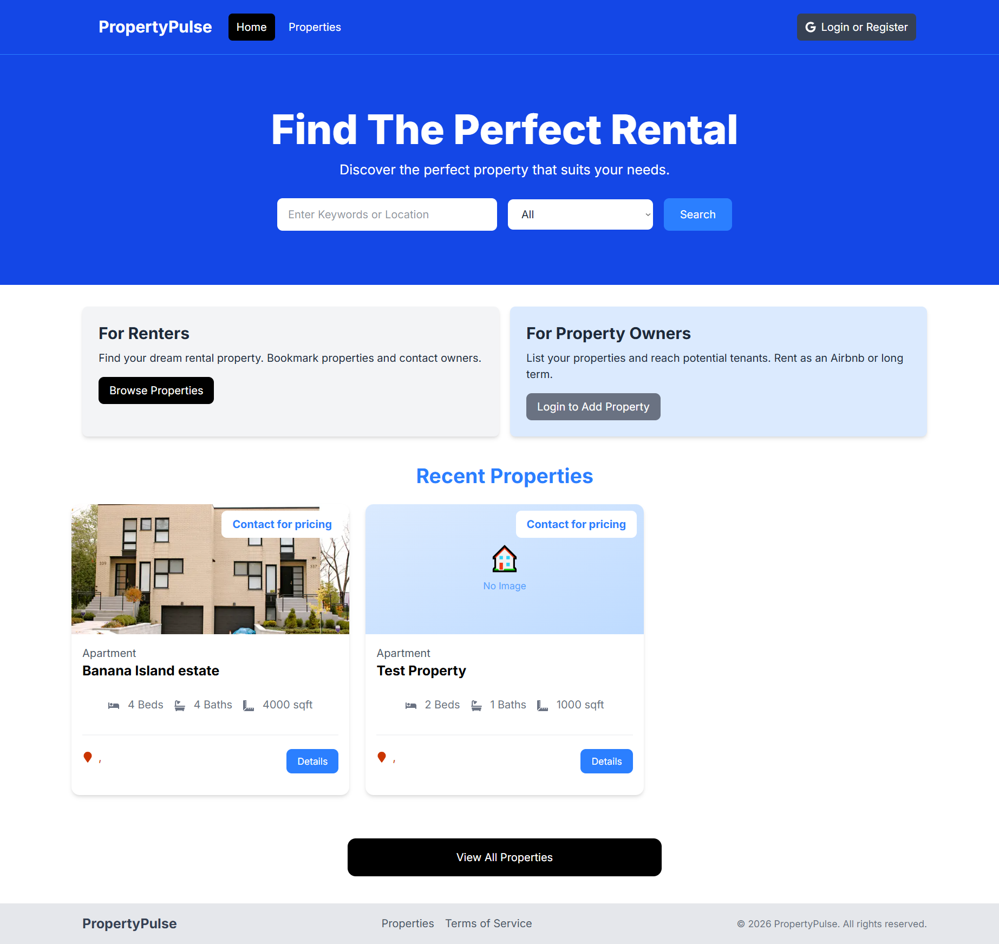
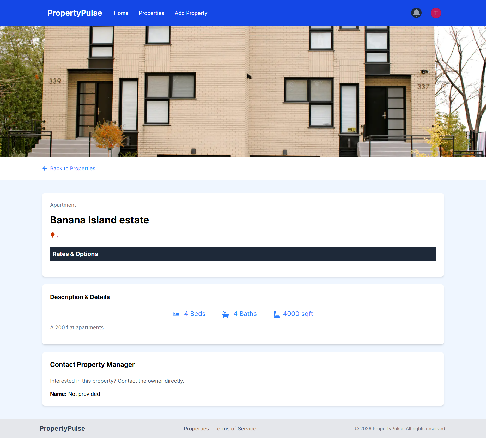
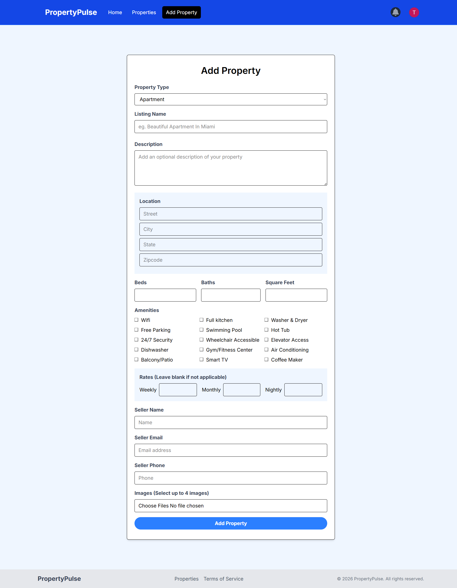

<div align="center">

# 🏠 PropertyPulse

### Find The Perfect Rental Property

A full-stack real estate listing platform built with **Next.js 16**, **MongoDB**, and **NextAuth.js**.

[](https://nextjs.org/)
[](https://www.typescriptlang.org/)
[](https://www.mongodb.com/)
[](https://tailwindcss.com/)

[Live Demo](https://property-pulse-phi-vert.vercel.app) · [Report Bug](https://github.com/tobajetex/property-pulse/issues) · [Request Feature](https://github.com/tobajetex/property-pulse/issues)

</div>

---

## 📖 About The Project

**PropertyPulse** is a modern, full-stack real estate platform where users can browse, list, and manage rental properties. Built with the latest Next.js App Router, it features Google authentication, image uploads via Cloudinary, interactive maps, and a beautiful responsive UI.

Whether you're a **renter** looking for your next home or a **property owner** wanting to list your space, PropertyPulse provides a seamless experience from search to contact.

---

## 📸 Screenshots

### Homepage



### Property Details



### Add Property



---

## ✨ Features

### 🔐 Authentication & Authorization

- **Google OAuth** sign-in via NextAuth.js
- **Protected routes** with middleware
- **Role-based access** — only owners can edit/delete their properties
- **Session management** with JWT

### 🏘️ Property Management

- **Full CRUD** — Create, Read, Update, Delete properties
- **Multiple image uploads** via Cloudinary
- **Rich property details** — beds, baths, square feet, amenities, rates
- **Search & filter** — by location and property type
- **Pagination** for large result sets

### 💬 User Features

- **Bookmark properties** — save favorites for later
- **Contact property owners** — internal messaging system
- **Unread message notifications** — real-time badge count
- **User profile** — manage your own listings
- **Saved properties page** — view all bookmarks

### 🗺️ Advanced Features

- **Interactive maps** — powered by Mapbox
- **Address geocoding** — automatic coordinate lookup
- **Image gallery** — Photoswipe lightbox
- **Social sharing** — Facebook, Twitter, WhatsApp, Email
- **Featured properties** — highlight premium listings
- **Responsive design** — works on all devices
- **Custom 404 & error pages**

---

## 🛠️ Tech Stack

### Frontend

| Technology         | Purpose                         |
| ------------------ | ------------------------------- |
| **Next.js 16**     | React framework with App Router |
| **React 19**       | UI library                      |
| **TypeScript**     | Type safety                     |
| **Tailwind CSS**   | Utility-first styling           |
| **React Icons**    | Icon library                    |
| **React Toastify** | Toast notifications             |
| **React Spinners** | Loading indicators              |

### Backend

| Technology                 | Purpose                          |
| -------------------------- | -------------------------------- |
| **Next.js Server Actions** | API logic without REST endpoints |
| **MongoDB**                | NoSQL database                   |
| **Mongoose**               | MongoDB ODM                      |
| **NextAuth.js**            | Authentication                   |
| **Cloudinary**             | Image upload & storage           |

### Integrations

| Service              | Purpose                |
| -------------------- | ---------------------- |
| **Google OAuth**     | User authentication    |
| **Cloudinary**       | Property image hosting |
| **Mapbox GL**        | Interactive maps       |
| **Google Geocoding** | Address to coordinates |
| **MongoDB Atlas**    | Cloud database hosting |
| **Vercel**           | Deployment platform    |

---

## 🏗️ Architecture

```
┌─────────────────────────────────────────────────────┐
│                   Next.js App Router                │
├─────────────────────────────────────────────────────┤
│  Server Components ──────────► Database Queries     │
│         │                              │            │
│         ▼                              ▼            │
│  Client Components ───► Server Actions ───► MongoDB │
│         │                      │                    │
│         ▼                      ▼                    │
│  Interactive UI           External APIs             │
│                          (Cloudinary, Mapbox)       │
└─────────────────────────────────────────────────────┘
```

### Data Flow

1. **User interacts** with a client component
2. **Server Action runs** on the server
3. **Database is queried** via Mongoose
4. **External services** (Cloudinary, etc.) are called
5. **Response is returned** and UI updates
6. **Cache is revalidated** for fresh data

---

## 📁 Project Structure

```
property-pulse/
├── app/                          # Next.js App Router
│   ├── actions/                  # Server Actions
│   │   ├── addProperty.ts       # Create property
│   │   ├── updateProperty.ts    # Update property
│   │   ├── deleteProperty.ts    # Delete property
│   │   ├── addMessage.ts        # Send message
│   │   ├── deleteMessage.ts     # Delete message
│   │   ├── markMessageAsRead.ts # Toggle read status
│   │   ├── bookmarkProperty.ts  # Toggle bookmark
│   │   ├── checkBookmarkStatus.ts
│   │   └── getUnreadMessageCount.ts
│   ├── api/auth/[...nextauth]/  # NextAuth API route
│   ├── messages/                 # Messages page
│   ├── profile/                  # Profile page
│   ├── properties/               # Property pages
│   │   ├── [id]/                # Property detail & edit
│   │   ├── add/                 # Add property
│   │   ├── saved/               # Saved properties
│   │   └── search-results/      # Search results
│   ├── layout.tsx                # Root layout
│   └── page.tsx                  # Home page
├── components/                   # React Components
│   ├── AuthProvider.tsx
│   ├── Navbar.tsx
│   ├── Footer.tsx
│   ├── Hero.tsx
│   ├── PropertyCard.tsx
│   ├── PropertyDetails.tsx
│   ├── PropertyAddForm.tsx
│   ├── PropertyEditForm.tsx
│   ├── PropertySearchForm.tsx
│   ├── PropertyMap.tsx
│   └── ... (more)
├── config/                       # Configuration
│   ├── database.ts              # MongoDB connection
│   └── cloudinary.ts            # Cloudinary config
├── models/                       # Mongoose Models
│   ├── User.ts
│   ├── Property.ts
│   └── Message.ts
├── utils/                        # Utilities
│   ├── authOptions.ts           # NextAuth config
│   ├── getSessionUser.ts        # Session helper
│   └── convertToObject.ts       # Serialization helper
├── types/                        # TypeScript types
│   └── next-auth.d.ts
├── middleware.ts                 # Route protection
└── next.config.ts                # Next.js config
```

---

## 🚀 Getting Started

### Prerequisites

Make sure you have the following installed:

- **Node.js** v18.17 or higher
- **npm** or **yarn** or **pnpm**
- **Git**

You'll also need accounts on:

- [**MongoDB Atlas**](https://www.mongodb.com/atlas) — for the database
- [**Cloudinary**](https://cloudinary.com/) — for image uploads
- [**Google Cloud Console**](https://console.cloud.google.com/) — for OAuth
- [**Mapbox**](https://www.mapbox.com/) — for maps

### Installation

1. **Clone the repository**

```bash
git clone https://github.com/tobajetex/property-pulse.git
cd property-pulse
```

2. **Install dependencies**

```bash
npm install
```

3. **Set up environment variables**

Create a `.env.local` file in the root directory:

```env
# MongoDB
MONGODB_URI=your_mongodb_connection_string

# NextAuth
NEXTAUTH_URL=http://localhost:3000
NEXTAUTH_SECRET=your_generated_secret

# Google OAuth
GOOGLE_CLIENT_ID=your_google_client_id
GOOGLE_CLIENT_SECRET=your_google_client_secret

# Cloudinary
CLOUDINARY_CLOUD_NAME=your_cloud_name
CLOUDINARY_API_KEY=your_api_key
CLOUDINARY_API_SECRET=your_api_secret

# Mapbox
NEXT_PUBLIC_MAPBOX_TOKEN=your_mapbox_token

# Google Geocoding
NEXT_PUBLIC_GOOGLE_GEOCODING_API_KEY=your_geocoding_key
```

4. **Generate a NextAuth secret**

```bash
openssl rand -base64 32
```

5. **Run the development server**

```bash
npm run dev
```

6. **Open your browser**

Navigate to [http://localhost:3000](http://localhost:3000) to see the app!

---

## 🔑 Environment Variables

| Variable                               | Description               | Where to Get                  |
| -------------------------------------- | ------------------------- | ----------------------------- |
| `MONGODB_URI`                          | MongoDB connection string | MongoDB Atlas Dashboard       |
| `NEXTAUTH_URL`                         | Your app URL              | `http://localhost:3000` (dev) |
| `NEXTAUTH_SECRET`                      | Random secret for JWT     | `openssl rand -base64 32`     |
| `GOOGLE_CLIENT_ID`                     | Google OAuth client ID    | Google Cloud Console          |
| `GOOGLE_CLIENT_SECRET`                 | Google OAuth secret       | Google Cloud Console          |
| `CLOUDINARY_CLOUD_NAME`                | Cloudinary account name   | Cloudinary Dashboard          |
| `CLOUDINARY_API_KEY`                   | Cloudinary API key        | Cloudinary Dashboard          |
| `CLOUDINARY_API_SECRET`                | Cloudinary API secret     | Cloudinary Dashboard          |
| `NEXT_PUBLIC_MAPBOX_TOKEN`             | Mapbox access token       | Mapbox Account                |
| `NEXT_PUBLIC_GOOGLE_GEOCODING_API_KEY` | Google Geocoding key      | Google Cloud Console          |

---

## 📜 Available Scripts

| Command         | Description              |
| --------------- | ------------------------ |
| `npm run dev`   | Start development server |
| `npm run build` | Build for production     |
| `npm run start` | Start production server  |
| `npm run lint`  | Run ESLint               |

---

## 🗄️ Database Models

### User

```typescript
{
  email: string (unique, required);
  username: string (required);
  image: string;
  bookmarks: ObjectId[]; // References to Property
  timestamps: true;
}
```

### Property

```typescript
{
  owner: ObjectId; // References User
  name: string;
  type: string;
  description: string;
  location: { street, city, state, zipcode };
  beds: number;
  baths: number;
  square_feet: number;
  amenities: string[];
  rates: { nightly, weekly, monthly };
  seller_info: { name, email, phone };
  images: string[]; // Cloudinary URLs
  is_featured: boolean;
  timestamps: true;
}
```

### Message

```typescript
{
  sender: ObjectId; // References User
  recipient: ObjectId; // References User
  property: ObjectId; // References Property
  name: string;
  email: string;
  phone: string;
  body: string;
  read: boolean;
  timestamps: true;
}
```

---

## 🎯 Key Features Explained

### Why Server Actions Instead of API Routes?

Next.js 14+ **Server Actions** let us run server-side code directly from React components:

✅ **Simpler** — No need for separate API endpoints  
✅ **Type-safe** — Automatic TypeScript inference  
✅ **Colocated** — Logic lives with the components that use it  
✅ **Built-in revalidation** — Automatic cache management  
✅ **Progressive enhancement** — Works even without JavaScript

### Why `dynamic = 'force-dynamic'`?

Pages that query the database need fresh data on every request. Adding:

```typescript
export const dynamic = "force-dynamic";
```

...tells Next.js to skip static generation and render at request time.

### Bookmark System

Instead of a separate collection, bookmarks are stored as an array of `Property` IDs inside the `User` document:

```typescript
bookmarks: [{ type: Schema.Types.ObjectId, ref: "Property" }];
```

**Benefits:**

- Simpler (one query with `.populate()`)
- Faster (no joins)
- Sufficient for typical use cases

---

## 🚀 Deployment

### Deploying to Vercel

1. **Push your code to GitHub**

```bash
git push origin main
```

2. **Import project in Vercel**

- Go to [vercel.com/new](https://vercel.com/new)
- Select your repository
- Vercel auto-detects Next.js

3. **Add environment variables**

In Vercel Dashboard → Settings → Environment Variables, add all variables from your `.env.local`.

**⚠️ Important:** Change `NEXTAUTH_URL` to your production URL:

```env
NEXTAUTH_URL=https://your-app.vercel.app
```

4. **Update Google OAuth redirect URIs**

In Google Cloud Console, add your Vercel URL:

```
https://your-app.vercel.app/api/auth/callback/google
```

5. **Deploy!**

Vercel will automatically build and deploy. Every push to `main` triggers a new deployment.

---

## 🐛 Troubleshooting

### Build fails with "buffering timed out"

**Cause:** Page is being prerendered at build time but needs a database connection.

**Fix:** Add `export const dynamic = 'force-dynamic';` to the page.

### "Failed to parse src 'h' on next/image"

**Cause:** Invalid image URL in the database.

**Fix:** Validate image URLs before rendering:

```typescript
const validImages = property.images?.filter(
  (img) => typeof img === "string" && img.startsWith("http"),
);
```

### "JWEDecryptionFailed"

**Cause:** Your `NEXTAUTH_SECRET` changed.

**Fix:** Clear browser cookies and sign in again.

### "Property 'id' does not exist on type 'Session'"

**Cause:** Missing type declarations.

**Fix:** Create `types/next-auth.d.ts`:

```typescript
import { DefaultSession } from "next-auth";

declare module "next-auth" {
  interface Session {
    user: { id: string } & DefaultSession["user"];
  }
}
```

---

## 🗺️ Roadmap

- [x] Google OAuth authentication
- [x] Property CRUD operations
- [x] Image uploads via Cloudinary
- [x] Property search & filter
- [x] Bookmarks
- [x] Messaging system
- [x] Interactive maps
- [x] Social sharing
- [x] Responsive design
- [x] Custom 404 & error pages
- [ ] User reviews & ratings
- [ ] Advanced analytics dashboard
- [ ] Email notifications
- [ ] Multi-language support
- [ ] Progressive Web App (PWA)

---

## 🤝 Contributing

Contributions make the open-source community amazing! Any contributions you make are **greatly appreciated**.

1. Fork the repository
2. Create your feature branch
   ```bash
   git checkout -b feature/AmazingFeature
   ```
3. Commit your changes
   ```bash
   git commit -m '✨ Add some AmazingFeature'
   ```
4. Push to the branch
   ```bash
   git push origin feature/AmazingFeature
   ```
5. Open a Pull Request

---

## 📄 License

Distributed under the **MIT License**. See `LICENSE` for more information.

---

## 🙏 Acknowledgments

- [Next.js Documentation](https://nextjs.org/docs)
- [MongoDB University](https://university.mongodb.com/)
- [Tailwind CSS](https://tailwindcss.com/)
- [NextAuth.js](https://next-auth.js.org/)
- [Cloudinary](https://cloudinary.com/)
- [Mapbox](https://www.mapbox.com/)

---

## 📬 Contact

**Oloruntoba Jethro Jetawo**

📧 jetawotobajetex@gmail.com

🔗 Project Link: [https://github.com/tobajetex/property-pulse](https://github.com/tobajetex/property-pulse)

---

<div align="center">

### ⭐ Star this repository if you found it helpful!

**Built with ❤️ using Next.js 16 and MongoDB**

</div>
